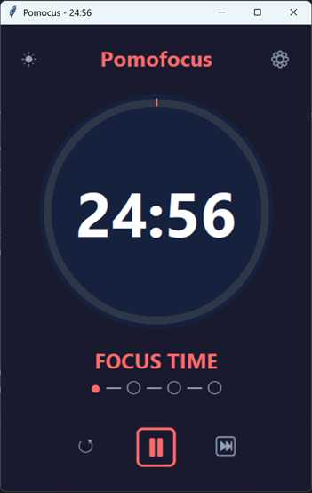
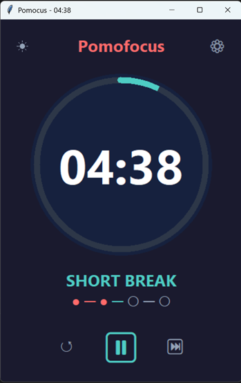
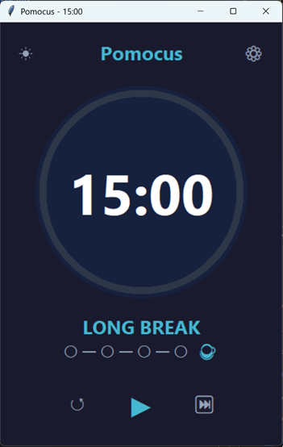
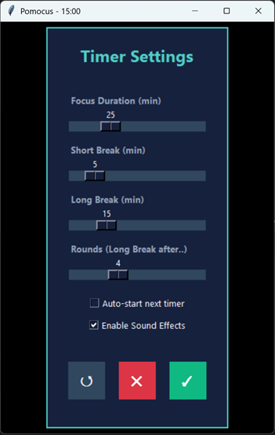
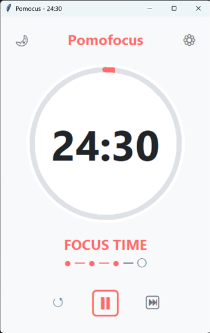
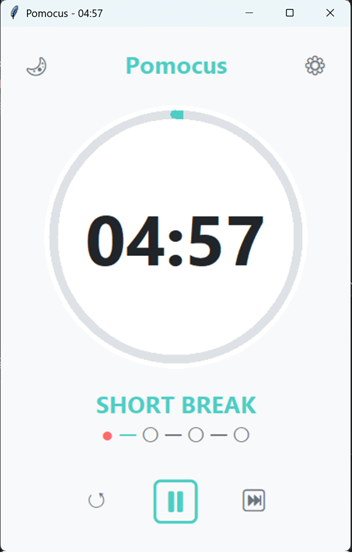
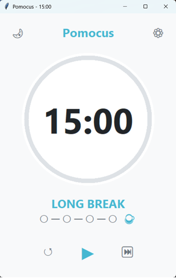
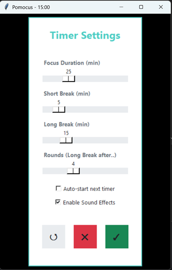

# pomocus-py


Pomocus is yet another Pomodoro Focus Timer, built with Python and `tkinter`.

Why should you use it? I don't know, but it's free, open source and I like it. It's also simple, just the time and its settings.

## Download

You can download the latest release from the [Releases](https://github.com/salamon/pomocus-py/releases) page.

## Screenshots

| Dark theme                                 | | | |
|--------------------------------------------|---|---|---|
|   |  |  |  |
| Light theme                                | | | |
|  |  |  |  |

 
## Requirements

- **Python 3.7+**

### Windows

Works out of the box with the standard Python installer.

### Ubuntu / Debian

Install `tkinter` and run with `python3`:

```bash
sudo apt-get install python3-tk
```

### macOS

`tkinter` is usually included with the official Python installer from python.org.
If you installed Python via Homebrew and `tkinter` is missing, install a python build that includes it.

There are no third-party dependencies.
 
## Run

From the project folder:

```bash
python pomocus_app.py
```

## Features
 
- **Focus / short break / long break** cycle
- **Configurable durations** (focus, short break, long break, long-break interval)
- **Auto-start next timer** (optional)
- **Sound effects** (optional)
- **Light/Dark theme toggle**
- **Skip phase** and **reset** controls (including reset the full flow)
 

## Usage
 
- **Start / Pause**: click the large play/pause button
- **Reset timer**: click reset (`↺`)
- **Reset the whole flow** (round counter + back to focus): double-click reset (`↺`)
- **Skip phase**: click skip (`⏭`)
- **Settings**: click the gear (`⚙`)
- **Theme**: click the theme toggle (sun/moon)
 
## Settings storage
 
Settings are saved to `pomocus_settings.json` in the project directory. It stores:
 
- Timer durations
- Long break interval
- Auto-start preference
- Sound enabled/disabled
- Theme mode
 
If the file is missing or invalid, defaults are used.

## Known issues

- Notification sounds use `tkinter`'s `bell()` and may be muted depending on OS settings.
- On Ubuntu/Debian, you may need `python3-tk` installed for `tkinter`.

## Support

If you find a bug or have a feature request, please open a GitHub issue.

## License

MIT (see `LICENSE`).